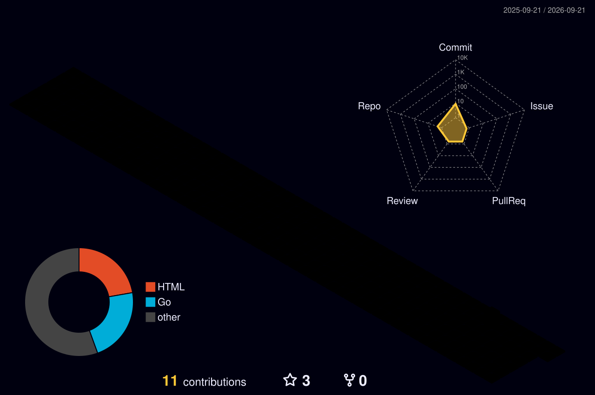

# 🛡️ Oktay Bilge

### **Cybersecurity Specialist & Full-Stack Software Engineer**

*Developing secure systems, automating penetration testing, and analyzing external attack surfaces.*

[🌐 oktaybilge.com](https://oktaybilge.com) | [✉️ contact@oktaybilge.com](mailto:contact@oktaybilge.com) | [💼 LinkedIn](https://linkedin.com/in/oktaybilge)

---

📊 **GitHub Stats & Streaks**

  
  
  

---

## 📊 3D Isometric Contribution Graph

Below is a 3D visualization of my contributions and commit activity over the past year, generated dynamically via GitHub Actions:

  

---

## 🛠️ Technical Expertise

<table>
  <tr>
    <td valign="top" width="50%">
      <strong>💻 Languages & Backend</strong> 
      • <strong>Go (Golang)</strong> (Gin, REST APIs, Microservices) 
      • <strong>Python</strong> (FastAPI, Scraping, Automation) 
      • <strong>C# / .NET</strong> (Core, MVC, Desktop Applications) 
      • <strong>TypeScript & JavaScript</strong> (Next.js, React)
    </td>
    <td valign="top" width="50%">
      <strong>🛡️ Cybersecurity & DevSecOps</strong> 
      • <strong>Vulnerability Auditing</strong> (Nmap, Nikto, Nuclei) 
      • <strong>Attack Surface Management</strong> (EASM tools, Recon) 
      • <strong>Security Architecture</strong> (CSP, CORS, HSTS configurations) 
      • <strong>Infrastructure</strong> (Docker, Caddy, Redis, PostgreSQL)
    </td>
  </tr>
</table>

---

## 🚀 Highlighted Projects

* **[Mangudai ASM (Overview)](https://github.com/oktaybilge1/mangudai-overview)**: A public documentation and showcase hub for the Mangudai External Attack Surface Management platform (Go, Next.js, Redis, Postgres).
* **[UrlCrawler](https://github.com/oktaybilge1/UrlCrawler)**: A Go-based security scanning application automating Nmap, Assetfinder, and Nuclei vulnerability scans.
* **[Financial Data Management System](https://github.com/oktaybilge1/FinansalVeriYonetimSistemi)**: An integrated Spring Boot 3 & Python parsing system collecting currency, cryptocurrency, and stock index data.

---

## 🧪 Concept Sandbox & Viral Demos

*This is my daily playground where I publish **proof-of-concepts, UI mockups, and architectural teasers** for viral cybersecurity and automation tools. Source codes for these concepts are closed or available upon high community interest.*

> [!TIP]
> **Active Concept: [Your Current Sandbox Project Name]**
> *Status:* ⚡ Teaser Live | *Seeking Feedback:* Drop a ⭐ or open an Issue to vote for a full open-source release!

---

## 📬 Let's Connect

* **Website:** [oktaybilge.com](https://oktaybilge.com)
* **Email:** [contact@oktaybilge.com](mailto:contact@oktaybilge.com)
* **LinkedIn:** [linkedin.com/in/oktaybilge](https://linkedin.com/in/oktaybilge)
